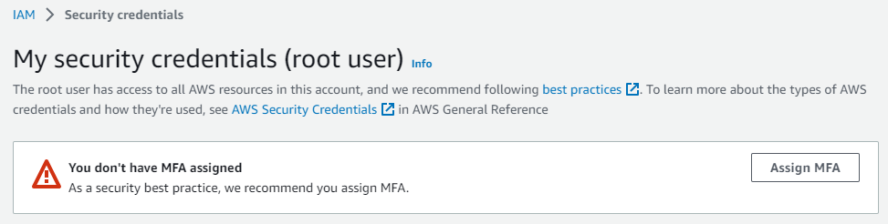
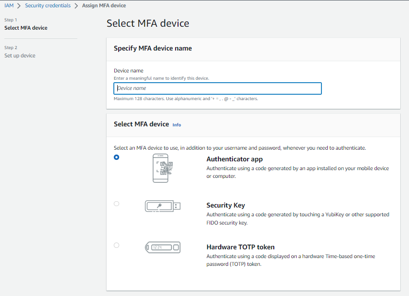
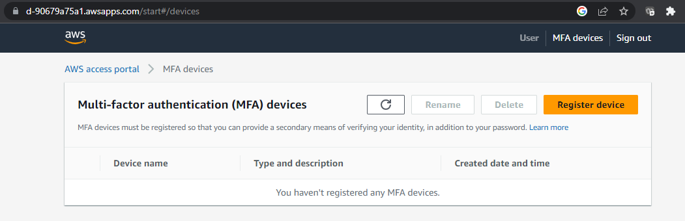
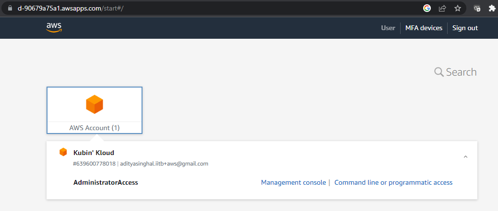

# terraform-on-aws
Terraform scripts to create and setup basic infrastructure for various resources

# Setup AWS account

Creation of an AWS account is as-easy-as creating an email ID on any website. But to be honest, this requires additional information such as an email ID, credit card, purpose of account and most importantly, the address (to find you if credit card declines). 

# Never use Root user, add MFA
Below article gives a clear insight how we can enable MFA for root user. 

https://aws.amazon.com/getting-started/guides/setup-environment/module-two/

# Setup a user 'a' using IAM Identity Center

This user needs to be added to a group 'Admins'. After addition, the user will receive an email to login to the application and register MFA device of their choice as in below image.

Once the user has registered a device, an AWS account will be visible to which the user has authorized access (refer below image)

# Setup multiple users for controlled access

We need to create another user 'b' with same group as user 'a' using IAM Identity Center. This will send an invite to the registered user email for user 'b' to login to the AWS Access Portal. Similar to user 'a', user 'b' can also register MFA of their choice to proceed to authorized AWS account.

# Setup AWS accounts for different environments

For creating a new AWS account 'A', you need to switch the 'Organization' menu and create a new AWS account. This will require an email ID which will be used for root user access. Since this new AWS account 'A' is created from within the organization, this will automatically create role "OrganizationAccountAccessRole". The said role is essential to switch role from Organization account to Member accout (Account 'A'). 

**NOTE:** Kindly note that assume role feature is unavailable to Root user, and only avaialable for IAM Identity Centre users. For Root user to access the account, the user must login via AWS Management Console.

To switch to account A using "Switch Role" in the top-right corner dropdown. This will require the AWS account ID, and concerned role (in Account A) "OrganizationAccountAccessRole" to assume role into the member account. 

# AWS account structure for an Organization

Since as users, we have the flexibility to create 'n' number of AWS accounts. Here, 'n' can range from zero to infinity, the definition of AWS Account structure must come in place to keep the context clear and well-defined. 

As part of this structure, it's recommended that one should create another AWS account for DevOps and Automation activities. This account shall be used for running any Terraform setup, or creation of resources, or for any automation access/scripting. 

Once the account is created under the organization, the role "OrganizationAccountAccessRole" is automatically created in "DevOps" AWS account. This can be used to switch from Organization account to member account. However, it's recommended that one should create another user under "DevOps" account, such as infra-user, automation-user, terraform-user etc in IAM. These users will be used to access various AWS accounts to interact with AWS resources. It's importatnt that we also create required roles in the target AWS accounts which allows these users to assume role (such as by using aws-cli).

aws_credentials=$(aws sts assume-role --role-arn arn:aws:iam::<target-account-A-AWS-id>:role/OrganizationAccountAccessRole --role-session-name "OrgRoleSessionDevOps1" --output json --profile aws-user-a)

export AWS_ACCESS_KEY_ID=$(echo $aws_credentials|jq '.Credentials.AccessKeyId'|tr -d '"')
export AWS_SECRET_ACCESS_KEY=$(echo $aws_credentials|jq '.Credentials.SecretAccessKey'|tr -d '"')
export AWS_SESSION_TOKEN=$(echo $aws_credentials|jq '.Credentials.SessionToken'|tr -d '"')